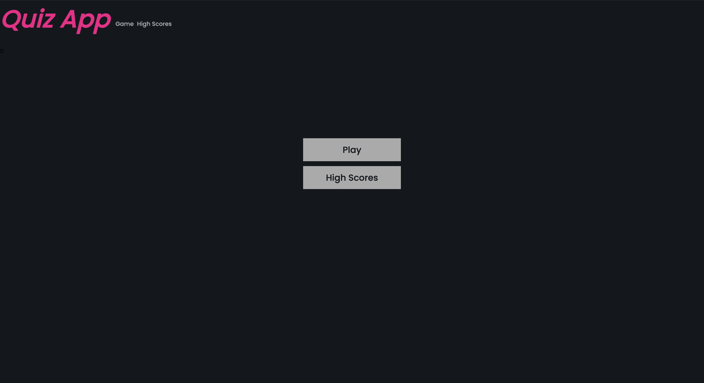
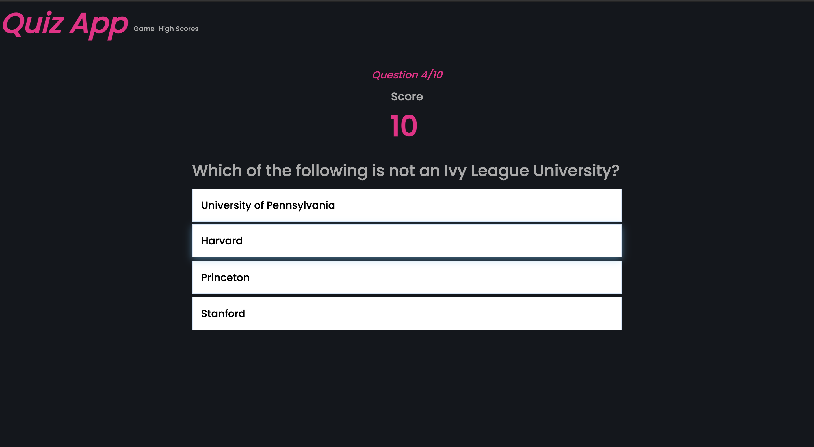
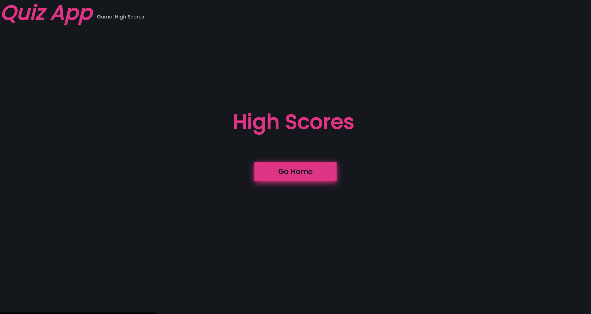

# Quiz App

* 💻 [Deployed Site](https://sarahjameson.github.io/quiz-app/index.html)
* 🗂 [GitHub Repository](https://github.com/sarahjameson/quiz-app)

## About

This quiz app was created for people to test out their trivia skills. The categories and difficulties are random each question so the user is always in for a surprise. At the end, you can see your score and compare with friends. It is a fun way to compete and learn. People of all ages can take something from the Quiz App. Whether it be confirming you're a total smart ass or learning through your mistakes.

## Table of Contents

## UX Experience

### User Stories

* As a visitor who is looking to find new ways to spend their time
    - I want to understand the site and its purpose
    - I want to view the different capabailties of the site immediately and not be overwhelmed
    - I want to have links available at all time so I can leave the game or go to the highscores if I get bored during the game

* As a visitor who wants to bond with their friends in a new way
    - I want a scoring functionality so we can both compared
    - I want the site to have a trendy appearance so that the site fits into the narrative of a trendy time no matter the age
    - I want the user to see that you can learn and compete but involve friends at the same time

* As a visitor who wants to learn in their spare time
    - I want to have random categories adn difficulties to keep challenging me and keeping me on my toes
    - I want a simple to use site that doesn't take away from the activity. Otherwise, I would get sick of clicking on unecessary things

### Wireframe
I used wireframes to start my planning process
* Mobile, Tablet, and Desktop wireframes are all available [here](assets/wireframes).

### Design

* Colour Scheme
    - For this quiz app, I didn't want to overcomplicate things so selected three colours from [the Adobe website](https://color.adobe.com/explore). The colours were the following:
    * #F20587
    * #aaa
    * #13171D

* Typography
    - I used Google fonts for the copy
    - I used Rubik for the logo. It is a fun, modern and trendy font. It shocks the senses in pink and slanted.
    - Poppins was used for the all the other writing. It is a fun, modern and stylish font which adds to the appearance of the page. It is easy to read and doesn't overcomplate the sensory experience.

## Features

* Header
    - The header is at the top of the pages
    - The logo is positioned at the top and is visible on all pages
    - There are links to direct to the page's different sections
    - There is a hover effect and the mouse changes when hovered to indicate that it can be clicked
* Main
    - The game is the main area's focus
* Landing page
    - Gives clear options through two buttons
    - The buttons are in the middle of the page and give two options. The focus on the buttons gives a sense of excitment. What will happen if I click game? What questions will I get this time?
* Future Features
    - It would be nice to make the game more customisable with the options to have specific categories and difficulty levels

## Technologies Used

### Languages Used
* [HTML5](https://en.wikipedia.org/wiki/HTML5)
* [CSS3](https://en.wikipedia.org/wiki/CSS)

### Libraries and Programs Used
* [Adobe colour picker](https://color.adobe.com/create/color-wheel) - Used for picking colour scheme
* [Google Fonts](https://fonts.google.com/) - Used for font selection and importation
* [Git](https://git-scm.com/) - Used for version control
* [GitHub](https://github.com/) - Used for hosting the website on GitHub Pages
* [Open Trivia API](https://opentdb.com/) - Used to get questions and answers to quiz

## Testing
### Navigation Bar
* When each of the navigation links are clicked, they bring me to the right place
* All links are working and have been tested
* The navigation bar is at the top of the page

### Game
* Displays green or red depending on answer
* Generate new question after answering question
* Goes through 10 questions and then ends
* Answers are displaying correctly with the correct one known as the correct one

### CSS3 Validator - Pass
* See results [here](https://jigsaw.w3.org/css-validator/validator?uri=https%3A%2F%2Fsarahjameson.github.io%2Fquiz-app%2Findex.html&profile=css3svg&usermedium=all&warning=1&vextwarning=&lang=en)

### HTML5 Validator
* Landing Page - [Results](https://validator.w3.org/nu/?doc=https%3A%2F%2Fsarahjameson.github.io%2Fquiz-app%2Findex.html)
* Game Page - [Results](https://validator.w3.org/nu/?doc=https%3A%2F%2Fsarahjameson.github.io%2Fquiz-app%2Fgame.html)
* Highscores Page - [Results](https://validator.w3.org/nu/?doc=https%3A%2F%2Fsarahjameson.github.io%2Fquiz-app%2Fhighscores.html)
* End page - [Results](https://validator.w3.org/nu/?doc=https%3A%2F%2Fsarahjameson.github.io%2Fquiz-app%2Fend.html)

### Compatibility Testing
* It looks the same on different browsers
* The site is responsive on all devices

### Performance Testing
* Webpage Performance Testing was carried out with [WebPageTest](https://www.webpagetest.org/). The test location was set to Ireland and the browser was set to Chrome. There were some areas of improvement suggested such as security and cache static content. I will look tp improve these in the future.
* Landing Page - [Results](https://www.webpagetest.org/result/211022_AiDcEP_2ef6769b0cda7a166c167e41f4873632/)
* Game Page - [Results](https://www.webpagetest.org/result/211022_BiDcEW_b771a7c531ee25d9ea6f4308b6438845/)
* Highscore Page - [Results](https://www.webpagetest.org/result/211022_BiDcJQ_4677ff355aad71ede42399dad30a2b91/)
* End page - [Results](https://www.webpagetest.org/result/211022_BiDcBQ_45f9ad611f0a3c37868c732b5d7264b8/)

### Testing User Stories
* As a visitor who is looking to find new ways to spend their time
    - I want to understand the site and its purpose
    The landing page is clear with no overcomplications. There is a clear hierarchy and journey in the page that leads the user to click on a button to discovered the site's main function
    - I want the questions asked to be random and different so it becomes addictive to see what question comes next
    The game makes use the the Open Trivia API to ensure that questions are as random and varied as possible
    - I want the questions to be scored so that the user can have an indicator of how they performed
    The score is being counted throughout the game and is visible one screen so user can keep count
* As a visitor who wants to bond with their friends in a new way
    - I want to see that this is a trendy trivia site
    The colour scheme and font show a trendy side that is appealing to friend groups
    - I want to understand that I can use this site to spend time with my friends
    The site shows that there is a highscore area so I can compete with my friends or even play together to pool our knowledge resources
* As a visitor who wants to learn in their spare time
    - I want to have varied questions that I might not know much about
    The Open Trivia API ensures that I have a varied question pool that continues to challenge me everyday
    - I want to have a clear visual surroundings to the game so I can concentrate on the questions and learning

## Deployment

### Publishing

This website was published using [GitHub Pages](https://pages.github.com/).

Instructions to use it:
* Go to the GitHub website and log in
* On the left-hand side, you'll see all your repositories, select the appropriate one
* Under the name of your chosen Repository you will see different options. Click on 'Settings' located on the right hand side
* Scroll down till you see 'GitHub Pages' heading
* Under the 'Source' click on the dropdown and select 'master branch'
* The page will reload and you'll see the link of your published page displayed under 'GitHub' pages
* It may take a minute for the site to be published. The link changes to a green color when it is ready

### Forking

If you want to contribute to this website. You can fork it.

Instructions to do this:
* Go to the GitHub website and log in
* Find the repository
* On the right-hand side of the Repository name, you'll see the 'Fork' button. It's located next to the 'Star' and 'Watch' buttons
* This will result in your own copy which you can make changes to
* After changes are made, you can use the 'New Pull Request" button above the file in the original repository

### Cloning

You can create a copy on your local device by cloning it.

Instructions to do this:
* Go to the GitHub website and log in
* Find the repository
* Under repository name, select green button with words 'Clone or Download'
* Use 'Clone with HTTPS' option
* Open terminal and go to directory you wish to clone into
* Type 'git clone' and paste HTTPS link that was given

## Known Bugs

The highscore page is not working and I could not figure it out in the time. I tried to save scores to local storage and wanted the top five to be displayed in the highscores page. I wanted the user to be able to display their desired name beside the score. I will continue to work towards this functionality in the future. 

## Credits

* Responsive photos are from [Am I responsive](http://ami.responsivedesign.is/)
* I followed some YouTube tutorials for this project:
    - [Video 1](https://www.youtube.com/watch?v=u98ROZjBWy8&list=PLDlWc9AfQBfZIkdVaOQXi1tizJeNJipEx&index=1&ab_channel=JamesQQuick)
    - [Video 2](https://www.youtube.com/watch?v=riDzcEQbX6k&t=1355s)
    - [Video 3](https://www.youtube.com/watch?v=f4fB9Xg2JEY&t=101s)
    - [Video 4](https://www.youtube.com/watch?v=SgJ_femmsfg)
* A special thank you to my mentor Maranatha who motivated and pushed me to hand this in on time. I really enjoyed our last conversation and felt that it gave me a final push

