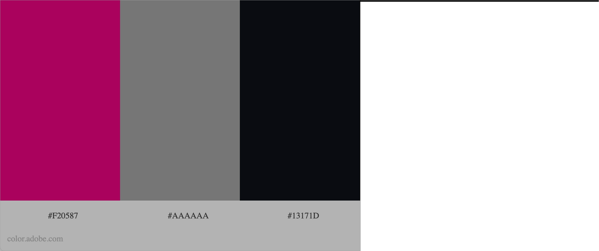

# Quiz App

* 💻 [Deployed Site](https://sarahjameson.github.io/quiz-app/index.html)
* 🗂 [GitHub Repository](https://github.com/sarahjameson/quiz-app)

## About

This quiz app was created for people to test out their trivia skills. The categories and difficulties are random each question so the user is always in for a surprise. At the end, you can see your score and compare with friends. It is a fun way to compete and learn. People of all ages can take something from the Quiz App. Whether it be confirming you're a total smart ass or learning through your mistakes.

## Table of Contents

## UX Experience

### User Stories

* As a visit who is looking to find new ways to spend their time
    - I want to understand the site and its purpose
    - I want to view the different capabailties of the site immediately and not be overwhelmed
    - I want to have links available at all time so I can leave the game or go to the highscores if I get bored during the game

* As a visitor who wants to bond with their friends in a new way
    - I want a scoring functionality so we can both compared
    - I want the site to have a trendy appearance so that the site fits into the narrative of a trendy time no matter the age
    - I want the user to see that you can learn and compete but involve friends at the same time

* As a visitor who wants to learn in their spare time
    - I want to have random categories adn difficulties to keep challenging me and keeping me on my toes
    - I want a simple to use site that doesn't take away from the activity. Otherwise, I would get sick of clicking on unecessary things

### Design

* Colour Scheme
    - For this quiz app, I didn't want to overcomplicate things so selected three colours from [the Adobe website](https://color.adobe.com/explore). The colours were the following:
    * #F20587
    * #aaa
    * #13171D

* Typography
    - I used Google fonts for the copy
    - I used Rubik for the logo. It is a fun, modern and trendy font. It shocks the senses in pink and slanted.
    - Poppins was used for the all the other writing. It is a fun, modern and stylish font which adds to the appearance of the page. It is easy to read and doesn't overcomplate the sensory experience.

## Features

* Header
    - The header is at the top of the pages
    - The logo is positioned at the top and is visible on all pages
    - There are links to direct to the page's different sections
    - There is a hover effect and the mouse changes when hovered to indicate that it can be clicked
* Main
    - The game is the main area's focus
* Landing page
    - Gives clear options through two buttons
    - The buttons are in the middle of the page and give two options. The focus on the buttons gives a sense of excitment. What will happen if I click game? What questions will I get this time?
* Future Features
    - It would be nice to make the game more customisable with the options to click specific categories and difficulty levels

